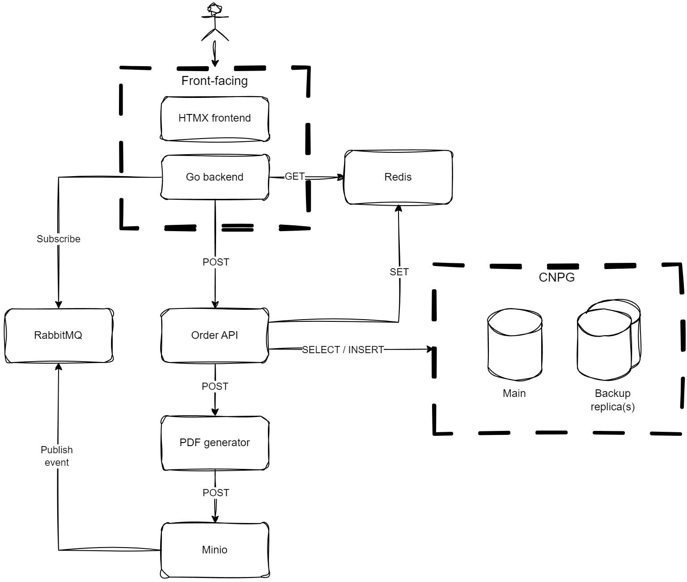

# cloud-reservation-system
## Introduction
This monorepo contains a project I devised for myself as an exercise to get more experience with cloud-based system design, Kubernetes, and fullstack development. The project is an implementation of a cloud-based reservation system where a customer can reserve an imaginary free product which has a limited configurable stock. After a customer sends out some basic order info, they will either receive a coupon for redeeming the product or an out-of-stock notice. Some of the questions which I aim to resolve with this project are:

* How to design and configure the system for high availability?
* How to prevent race conditions with replicated services?
* Could the frontend client utilize message queues instead of polling a DB?

## Architecture
### Diagram

### High Availability
HA with Kubernetes is achieved through configuring a suitable amount of replicas per component. For each contoller/operator configuration, the field `topologySpreadConstraints` is used for spreading replicas throughout Kubernets cluster and its nodes.

## Backend

### Order API
A Python implementation of an API using Tornado. This component is responsible for receiving an order, processing it, sending a correct response to the user client, and sending it to the next component if accepted.

The implementation in this component omits asynchronous handling of requests. This is due to the bottleneck that is caused by the DB described below.

### PostgreSQL
The database platform chosen for this project is PostgreSQL. It stores data of order details and has the status of available stock. To ensure status consistency between multiple simultaneous clients, everytime an order is submitted the relevant tables are locked untils stock availability is checked and the new order is created. If item is out of stock, or the order fails any other check (order or key user data already exixts) the lock is released pre-emptively.

CloudNativePG (CNPG) is used as a Kubernetes operator to manage a HA Postgres cluster. The configuration consists of a main instance and its backup replica(s) which is switched over to if the main instance fails. Having a single working DB and locking the tables for every request causes this component to be the biggest bottleneck of this design. This however is needed to ensure stock consistency between simultaneous requests.

Looking through the CAP theorem, this setup is a CP setup where consistency and partition tolerance are emphasized. Requests might have to wait due to processing only one request at time, but this ensures consistency. Backups are available if the main node fails.

### Redis
Redis (or the popular drop-in replacement Dragonfly) is used to cache information whether there is available stock or not. The frontend checks uses this cache to check if to display the order form for the user when starting a new session. The order API updates this cache whenever a new order has been created.

Dragonfly Operator is used for Kubernetes HA.

### PDF Generator
This service takes in order details of an accepted order and creates a PDF order voucher which the customer can use to redeem their order. The generated voucher file is sent to Minio from where it can be retrieved by the customer.

### MinIO
Storage service chosen for this solution. It has a storage bucket which is used to store generated PDF vouchers. Once a new PDF file is received, the event triggers a bucket notification which publishes the event to RabbitMQ. Object lifecycle management for the bucket is used to remove older vouchers.

MinIO Operator is used for Kubernetes HA.

### RabbitMQ
RabbitMQ is chosen as the messaging queue service here. When a new order is accepted, the user client starts listening to a topic related to the order in the MQ. Once the PDF voucher for that order is stored into Minio, an event is published to that same MQ topic which contains a link to the file resource.

RabbitMQ Cluster Kubernetes Operator is used for Kubernetes HA.

## Frontend

Actual plans TBD. Currently interested in researching into a BFF design pattern with HTMX and Golang.

## Missing features
List of features/improvements that could (or should) be implemented, but are not in the scope of this exercise:

* Secrets management
    * Passwords etc. are stored here in cleartext. An actual implementation would use Kubernetes Secret objects and something like Sealed Secrets for storing Secret objects. Secrets would be also be stored and read from environment variables instead of text files.
* Unit tests
* CI automation
* DB schema management by order API
* An actual design for the voucher look
    * Though I would love it; I'm not a graphical designer.

## Possible future improvements
List of future improvements that I'm interested in implementing/investigating, but currently not planning to:

* PDF generator as a Lambda function
    * PDF generator service could be a Lambda (or serverless) function instead of a fully-available service. Could be done with KNative, OpenFaas, or OpenWhisk. However, at this point I'm not if this use-case really benefits from Lambda functions.
* Kubernetes Leases
    * Utilizing Kubernetes Lease objects could replace the lock mechanism which makes the order database mutually exclusive while ensuring available stock and writing a new order.
* Change data capture
    * I would like to investigate if the cache service could be updated from PostgreSQL through CDC instead of the order API being responsible for this. Not sure though if using CDC here would be worth it.
* Monitoring
    * Centralized logging and monitoring with something like OpenSearch, Prometheus, Grafana, etc...
* End-to-end testing

## TODO
- [x] Backend
- [ ] Frontend client
- [ ] K8s configurations
- [ ] Plan and implement load tests
